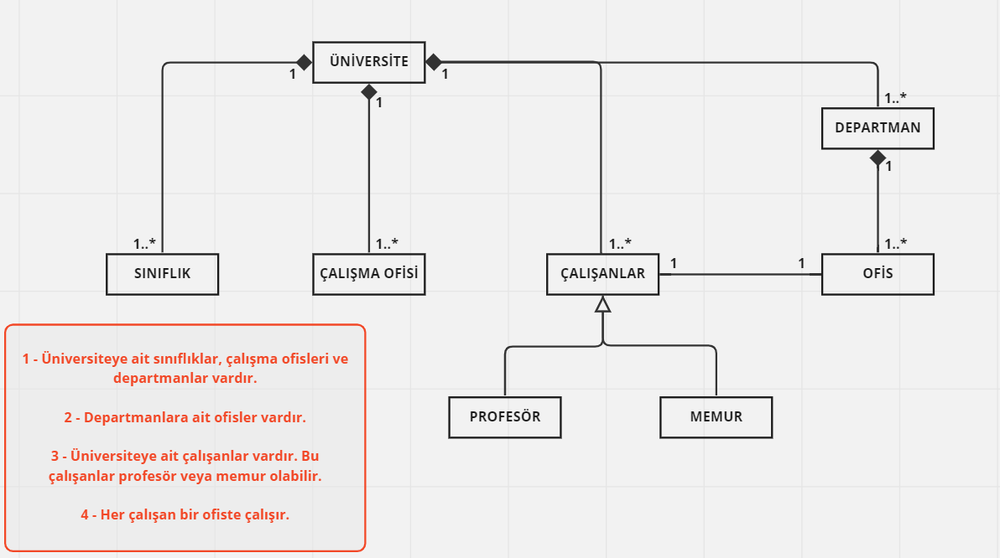

### 1 - Üniversiteye ait sınıflıklar, çalışma ofisleri ve departmanlar vardır.
### 2 - Departmanlara ait ofisler vardır.
### 3 - Üniversiteye ait çalışanlar vardır. Bu çalışanlar profesör veya memur olabilir.
### 4 - Her çalışan bir ofiste çalışır.
### Not : Sınıflara ait nitelik ve davranışların belirtilmesine gerek yoktur.
### Bu sistemi tasvir eden Class (Sınıf) diyagramı

